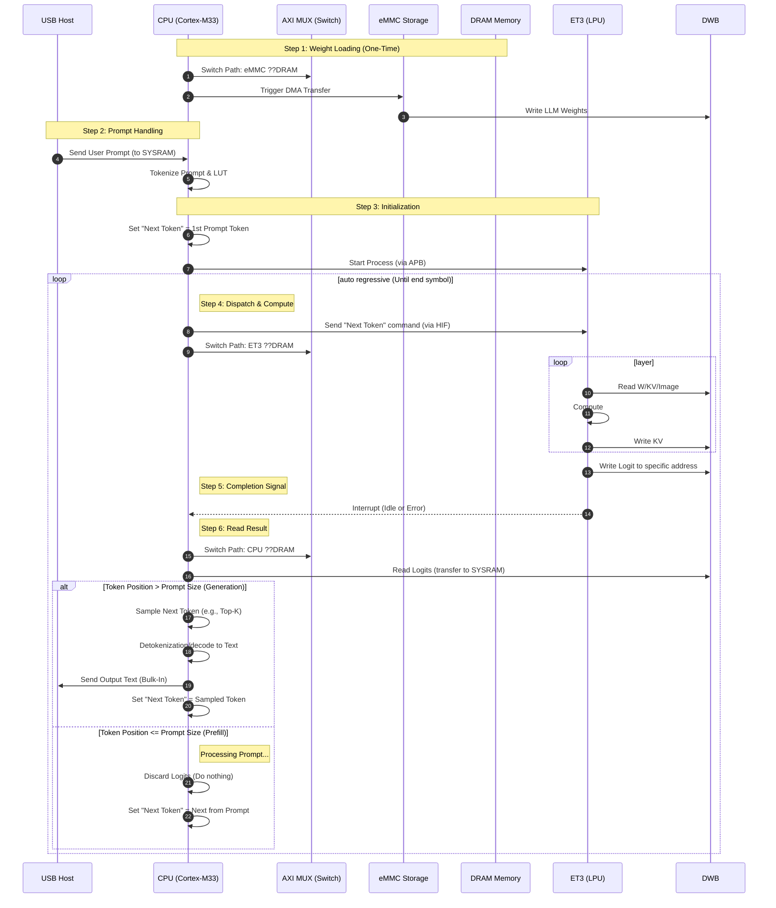
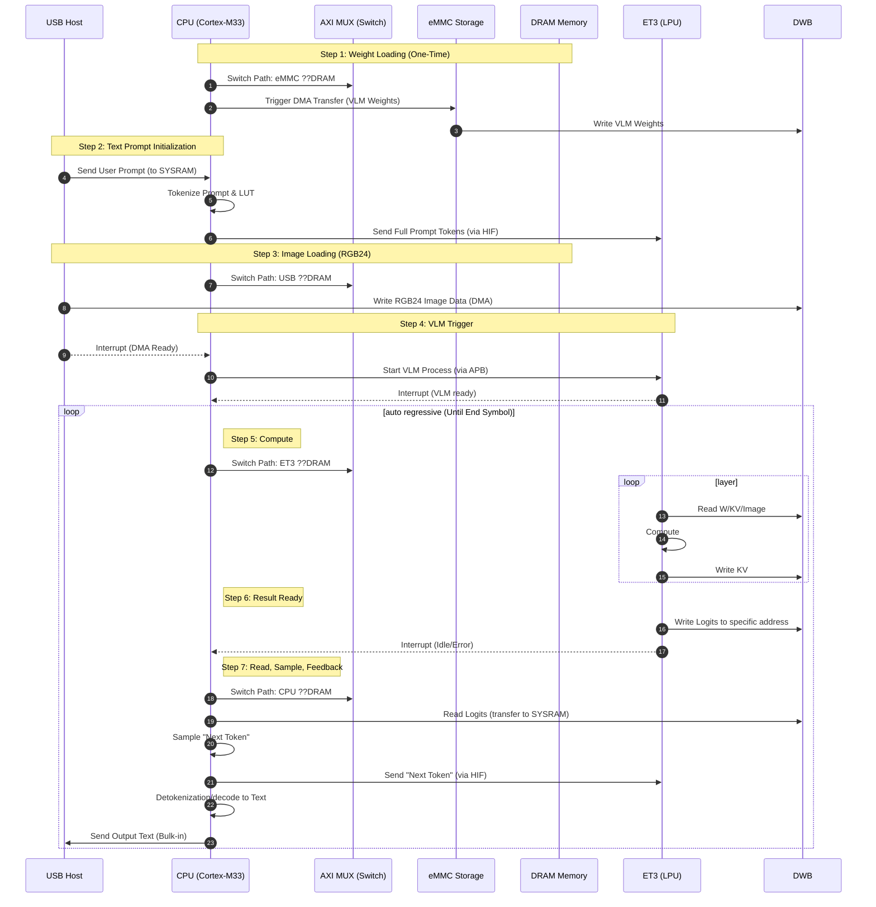
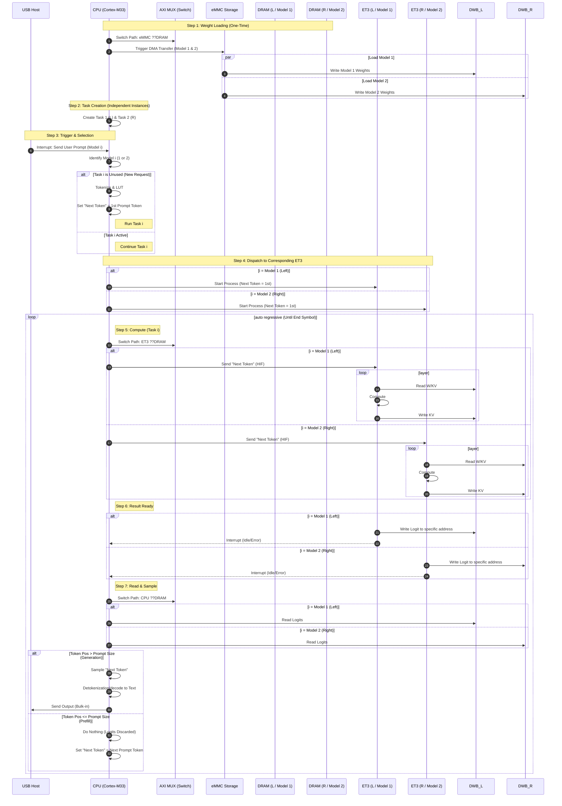
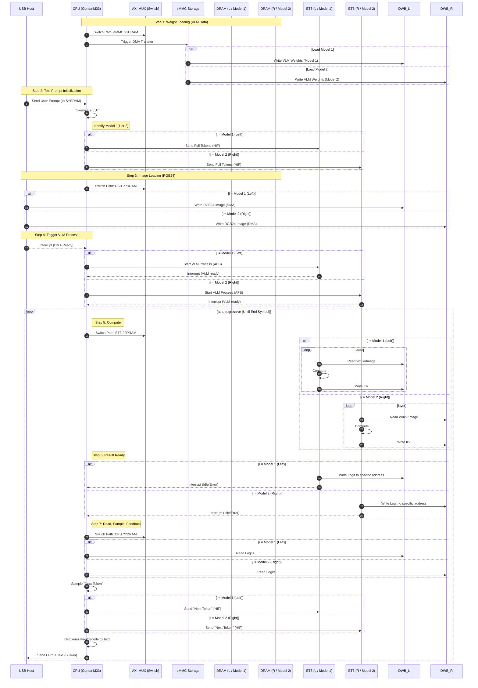

# Text-to-Text Single Model

```mermaid Text-to-Text Single Model
sequenceDiagram
    autonumber
    participant USB as USB Host
    participant CPU as CPU (Cortex-M33)
    participant MUX as AXI MUX (Switch)
    participant eMMC as eMMC Storage
    participant DRAM as DRAM Memory
    participant ET3 as ET3 (LPU)

    note over CPU, DRAM: Step 1: Weight Loading (One-Time)
    CPU->>MUX: Switch Path: eMMC ??DRAM
    CPU->>eMMC: Trigger DMA Transfer
    eMMC->>DWB: Write LLM Weights 
    
    note over USB, CPU: Step 2: Prompt Handling
    USB->>CPU: Send User Prompt (to SYSRAM)
    CPU->>CPU: Tokenize Prompt & LUT
    
    note over CPU, ET3: Step 3: Initialization
    CPU->>CPU: Set "Next Token" = 1st Prompt Token
    CPU->>ET3:  Start Process (via APB)
    loop auto regressive (Until end symbol)
        note right of CPU: Step 4: Dispatch & Compute
        CPU->>ET3: Send "Next Token" command (via HIF)
        CPU->>MUX: Switch Path: ET3 ??DRAM
        
        loop layer
            ET3->>DWB: Read W/KV/Image
            ET3->>ET3: Compute
            ET3->>DWB: Write KV
        end
        ET3->>DWB: Write Logit to specific address
        note right of CPU: Step 5: Completion Signal
        ET3-->>CPU: Interrupt (Idle or Error)
        
        note right of CPU: Step 6: Read Result
        CPU->>MUX: Switch Path: CPU ??DRAM
        CPU->>DWB: Read Logits (transfer to SYSRAM)
        
        alt Token Position > Prompt Size (Generation)
            CPU->>CPU: Sample Next Token (e.g., Top-K)
            CPU->>CPU: Detokenization/decode to Text
            CPU->>USB: Send Output Text (Bulk-In)
            CPU->>CPU: Set "Next Token" = Sampled Token
        else Token Position <= Prompt Size (Prefill)
            note right of CPU: Processing Prompt...
            CPU->>CPU: Discard Logits (Do nothing)
            CPU->>CPU: Set "Next Token" = Next from Prompt
        end
    end
```
# Video-to-Text, Single Model

```mermaid Video-to-Text, Single Model
 sequenceDiagram
    autonumber
    participant USB as USB Host
    participant CPU as CPU (Cortex-M33)
    participant MUX as AXI MUX (Switch)
    participant eMMC as eMMC Storage
    participant DRAM as DRAM Memory
    participant ET3 as ET3 (LPU)

    note over CPU, DRAM: Step 1: Weight Loading (One-Time)
    CPU->>MUX: Switch Path: eMMC ??DRAM
    CPU->>eMMC: Trigger DMA Transfer (VLM Weights)
    eMMC->>DWB: Write VLM Weights
    
    note over USB, CPU: Step 2: Text Prompt Initialization
    USB->>CPU: Send User Prompt (to SYSRAM)
    CPU->>CPU: Tokenize Prompt & LUT
    CPU->>ET3: Send Full Prompt Tokens (via HIF)
    
    note over USB, DRAM: Step 3: Image Loading (RGB24)
    CPU->>MUX: Switch Path: USB ??DRAM
    USB->>DWB: Write RGB24 Image Data (DMA)
    
    note over CPU, ET3: Step 4: VLM Trigger
    USB-->>CPU: Interrupt (DMA Ready)
    CPU->>ET3: Start VLM Process (via APB)    
    ET3-->>CPU: Interrupt (VLM ready)
    
    loop auto regressive (Until End Symbol)
        note right of CPU: Step 5: Compute
        CPU->>MUX: Switch Path: ET3 ??DRAM
        
        loop layer
            ET3->>DWB: Read W/KV/Image
            ET3->>ET3: Compute
            ET3->>DWB: Write KV
        end
       
        note right of CPU: Step 6: Result Ready
        ET3->>DWB: Write Logits to specific address
        ET3-->>CPU: Interrupt (Idle/Error)
        
        note right of CPU: Step 7: Read, Sample, Feedback
        CPU->>MUX: Switch Path: CPU ??DRAM
        CPU->>DWB: Read Logits (transfer to SYSRAM)
        CPU->>CPU: Sample "Next Token"
        CPU->>ET3: Send "Next Token" (via HIF)
        CPU->>CPU: Detokenization/decode to Text
        CPU->>USB: Send Output Text (Bulk-in)
    end
```
# Text-To-Text Dual Model

```mermaid Text-To-Text Dual Model
sequenceDiagram
    autonumber
    participant USB as USB Host
    participant CPU as CPU (Cortex-M33)
    participant MUX as AXI MUX (Switch)
    participant eMMC as eMMC Storage
    participant DRAM_L as DRAM (L / Model 1)
    participant DRAM_R as DRAM (R / Model 2)
    participant ET3_L as ET3 (L / Model 1)
    participant ET3_R as ET3 (R / Model 2)

    note over CPU, DRAM_R: Step 1: Weight Loading (One-Time)
    CPU->>MUX: Switch Path: eMMC ??DRAM
    CPU->>eMMC: Trigger DMA Transfer (Model 1 & 2)
    par Load Model 1
        eMMC->>DWB_L: Write Model 1 Weights
    and Load Model 2
        eMMC->>DWB_R: Write Model 2 Weights
    end

    note over CPU: Step 2: Task Creation (Independent Instances)
    CPU->>CPU: Create Task 1 (L) & Task 2 (R)

    note over USB, CPU: Step 3: Trigger & Selection
    USB->>CPU: Interrupt: Send User Prompt (Model i)
    CPU->>CPU: Identify Model i (1 or 2)
    
    alt Task i is Unused (New Request)
        CPU->>CPU: Tokenize & LUT
        CPU->>CPU: Set "Next Token" = 1st Prompt Token
        note right of CPU: Run Task i
    else Task i Active
        note right of CPU: Continue Task i
    end

    note over CPU, ET3_R: Step 4: Dispatch to Corresponding ET3
    alt i = Model 1 (Left)
        CPU->>ET3_L: Start Process (Next Token = 1st)
    else i = Model 2 (Right)
        CPU->>ET3_R: Start Process (Next Token = 1st)
    end

    loop auto regressive (Until End Symbol)
        note right of CPU: Step 5: Compute (Task i)
        CPU->>MUX: Switch Path: ET3 ??DRAM
        
        alt i = Model 1 (Left)
            CPU->>ET3_L: Send "Next Token" (HIF)
            loop layer
                ET3_L->>DWB_L: Read W/KV
                ET3_L->>ET3_L: Compute
                ET3_L->>DWB_L: Write KV
            end
        else i = Model 2 (Right)
            CPU->>ET3_R: Send "Next Token" (HIF)
            loop layer
                ET3_R->>DWB_R: Read W/KV
                ET3_R->>ET3_R: Compute
                ET3_R->>DWB_R: Write KV
            end
        end

        note right of CPU: Step 6: Result Ready
        alt i = Model 1 (Left)
            ET3_L->>DWB_L: Write Logit to specific address
            ET3_L-->>CPU: Interrupt (Idle/Error)
        else i = Model 2 (Right)
            ET3_R->>DWB_R: Write Logit to specific address
            ET3_R-->>CPU: Interrupt (Idle/Error)
        end

        note right of CPU: Step 7: Read & Sample
        CPU->>MUX: Switch Path: CPU ??DRAM
        
        alt i = Model 1 (Left)
            CPU->>DWB_L: Read Logits
        else i = Model 2 (Right)
            CPU->>DWB_R: Read Logits
        end

        alt Token Pos > Prompt Size (Generation)
            CPU->>CPU: Sample "Next Token"
            CPU->>CPU: Detokenization/decode to Text
            CPU->>USB: Send Output (Bulk-in)
        else Token Pos <= Prompt Size (Prefill)
            CPU->>CPU: Do Nothing (Logits Discarded)
            CPU->>CPU: Set "Next Token" = Next Prompt Token
        end
    end
```
# Video-To-Text Dual model

```mermaid Video-To-Text Dual model
sequenceDiagram
    autonumber
    participant USB as USB Host
    participant CPU as CPU (Cortex-M33)
    participant MUX as AXI MUX (Switch)
    participant eMMC as eMMC Storage
    participant DRAM_L as DRAM (L / Model 1)
    participant DRAM_R as DRAM (R / Model 2)
    participant ET3_L as ET3 (L / Model 1)
    participant ET3_R as ET3 (R / Model 2)

    note over CPU, DRAM_R: Step 1: Weight Loading (VLM Data)
    CPU->>MUX: Switch Path: eMMC ??DRAM
    CPU->>eMMC: Trigger DMA Transfer
    par Load Model 1
        eMMC->>DWB_L: Write VLM Weights (Model 1)
    and Load Model 2
        eMMC->>DWB_R: Write VLM Weights (Model 2)
    end

    note over USB, CPU: Step 2: Text Prompt Initialization
    USB->>CPU: Send User Prompt (to SYSRAM)
    CPU->>CPU: Tokenize & LUT
    note right of CPU: Identify Model i (1 or 2)
    
    alt i = Model 1 (Left)
        CPU->>ET3_L: Send Full Tokens (HIF)
    else i = Model 2 (Right)
        CPU->>ET3_R: Send Full Tokens (HIF)
    end

    note over USB, DRAM_R: Step 3: Image Loading (RGB24)
    CPU->>MUX: Switch Path: USB ??DRAM
    
    alt i = Model 1 (Left)
        USB->>DWB_L: Write RGB24 Image (DMA)
    else i = Model 2 (Right)
        USB->>DWB_R: Write RGB24 Image (DMA)
    end

    note over USB, CPU: Step 4: Trigger VLM Process
    USB-->>CPU: Interrupt (DMA Ready)

    alt i = Model 1 (Left)
        CPU->>ET3_L: Start VLM Process (APB)
        ET3_L-->>CPU: Interrupt (VLM ready)
    else i = Model 2 (Right)
        CPU->>ET3_R: Start VLM Process (APB)
        ET3_R-->>CPU: Interrupt (VLM ready)
    end

    loop auto regressive (Until End Symbol)
        note right of CPU: Step 5: Compute
        CPU->>MUX: Switch Path: ET3 ??DRAM
        
        alt i = Model 1 (Left)
            loop layer 
                ET3_L->>DWB_L: Read W/KV/Image
                ET3_L->>ET3_L: Compute
                ET3_L->>DWB_L: Write KV
            end
        else i = Model 2 (Right)
            loop layer
                ET3_R->>DWB_R: Read W/KV/Image
                ET3_R->>ET3_R: Compute
                ET3_R->>DWB_R: Write KV
            end
        end

        note right of CPU: Step 6: Result Ready
        alt i = Model 1 (Left)
            ET3_L->>DWB_L: Write Logit to specific address
            ET3_L-->>CPU: Interrupt (Idle/Error)
        else i = Model 2 (Right)
            ET3_R->>DWB_R: Write Logit to specific address
            ET3_R-->>CPU: Interrupt (Idle/Error)
        end

        note right of CPU: Step 7: Read, Sample, Feedback
        CPU->>MUX: Switch Path: CPU ??DRAM
        
        alt i = Model 1 (Left)
            CPU->>DWB_L: Read Logits
        else i = Model 2 (Right)
            CPU->>DWB_R: Read Logits
        end

        CPU->>CPU: Sample "Next Token"
        
        alt i = Model 1 (Left)
            CPU->>ET3_L: Send "Next Token" (HIF)
        else i = Model 2 (Right)
            CPU->>ET3_R: Send "Next Token" (HIF)
        end

        CPU->>CPU: Detokenization/decode to Text
        CPU->>USB: Send Output Text (Bulk-in)
    end
```